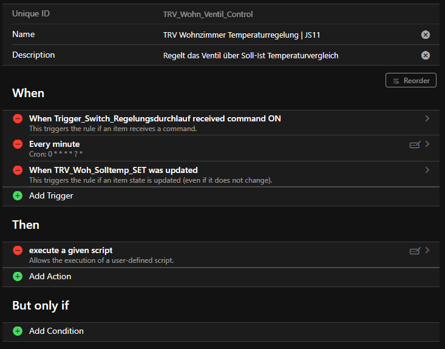
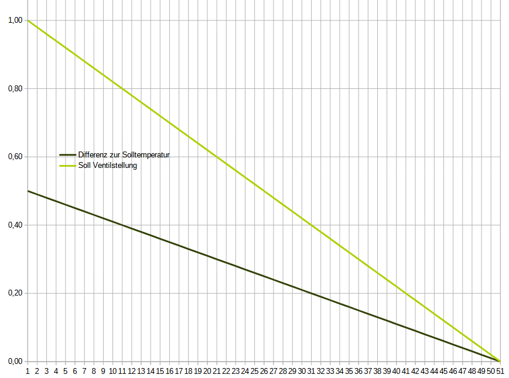
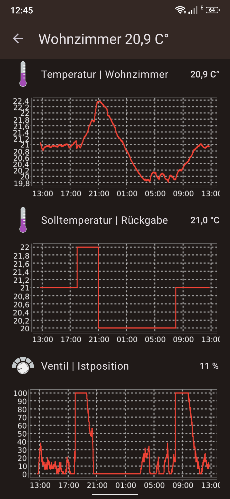

# Shelly TRV Ventilregelung über OpenHAB | Rule in JavaScript 11


## OpenHAB bietet für das Shelly TRV ein Binding an welches verschiedene Channels bereitstellt.

## Der Channel "Position" wird von der Temperraturregelung über OpenHab genutzt um immer die richtiige Ventilposition zu Soll-Ist Temperaturdifferenz einzuregeln.

### Beispiel Rule:

### Screnshot von der Ruleübersicht:


#### Hier wird in der "When" Bedingung drei Items mit ODER Logik verknüpft
1. Ein Triggerswitch (zum manuellen Auslösen der Rule zu jedem Zeitpunkt)
2. Ein Cron Timer der jede Minute die Rule auslöst.
3. Ein Auslöser, wenn jemand die Raumsolltemperatur verändert.

#### Sollte einer der drei Items eine Aktion (command oder update oder Zeitziel) löst die Rule aus.
#### Dabei wird folgender Code in JavaScript 11 abgearbeitet:

```JavaScript
// Ventilregelungsdurchlauf des TRV Wohnzimmmer 17.11.23

var Solltemp = 0; // Solltemperatur Wohnzimmer (parsen in Float)
var Isttemp = 0; // Isttemperatur Woohnzimmer (parsen in Float)
var DiffTemp = 0; // Differenz zwischen Soll-Ist Temperatur
var Grundwert = 0.5; // 100 % Wert der Differenz (Constante Float)
var VentiloeffnungInProzent = 0; // Prozentwert der Ventilöffnung 100 % = heizen ; 0 % = Heizung aus in Float
var VentiloeffnungInProzentInt = 0; // Geparster Wert in Int


// Meldung im Logbuch

console.log("TRV Regelung getriggert ++++++++++++++++++++++++++++++++++++++++++++++++++++++++++++++");


// Daten zur Berechnung holen und in Form bringen (parsen in Int)

Solltemp = parseFloat(items.getItem("TRV_Woh_Solltemp_SET").state); // Solltemperatur Wohnzimmer holen
console.log("Solltemperatur Wohnzimmer >>> ", Solltemp ); // Logbucheintrag

Isttemp = parseFloat(items.getItem("Wohnzimmer_Temperatur").state); // Solltemperatur Wohnzimmer holen
console.log("Isttemperatur Wohnzimmer >>> ", Isttemp ); // Logbucheintrag

// Berechnung der Differenz Soll-Ist Temperatur

DiffTemp = Solltemp - Isttemp ;

console.log("Difftemperatur Wohnzimmer >>> ", DiffTemp ); // Logbucheintrag


// Berechnung der Ventilöffnung in Prozent


VentiloeffnungInProzent = ( DiffTemp * 100 ) / Grundwert ;

console.log("Ventilöffnung nach berechnung Wohnzimmer >>> ", VentiloeffnungInProzent ); // Logbucheintrag


// Wertaufbereitung parsen von Float zu Int

VentiloeffnungInProzentInt = parseInt(VentiloeffnungInProzent)


// Wertbegrenzung 0-100

if (VentiloeffnungInProzentInt > 100){
    console.log("Ventilöffnung wird auf 100% begrenzt, weil errechneter Wert größer 100 nämlich >>> ", VentiloeffnungInProzentInt); // Logbucheintrag
    VentiloeffnungInProzentInt = 100;
}

if (VentiloeffnungInProzentInt < 0){
    console.log("Ventilöffnung wird auf 0% begrenzt, weil errechneter Wert kleiner 0 nämlich >>> ", VentiloeffnungInProzentInt); // Logbucheintrag
    VentiloeffnungInProzentInt = 0;
}


// Senden des Ventil % Wertes an TRV (sendCommand nicht postUpdate)

items.getItem("TRV_Wohn_Pos_Soll").sendCommand(VentiloeffnungInProzentInt); // Poste die neue Ventilöffnungsvariable

console.log("Ventilöffnung in % wird an das TRV gesendet >>> ", VentiloeffnungInProzentInt ); // Logbucheintrag

``` 
#### Durch diese Rule wird ein Ventilöffnungswert zwischen 0 und 100 berechnet und an das TRV gesendet.
#### Die Constante "Grundwert" beschreibt die maximale Abweichung von eingestellten Raumsollwert. Sie kann selbstverständlich nach belieben verändert werden oder in ein Item mit Setpoint direkt in der WebUI eingestellt werden.

### Mit der o.g. Rule bekommen wird folgenden Regelungsverlauf der hier grafisch dargestellt wird.




### Ich habe noch einen Auszug aus der praktischen Auszug der Rule über 24h. aus der OpenHAB App

